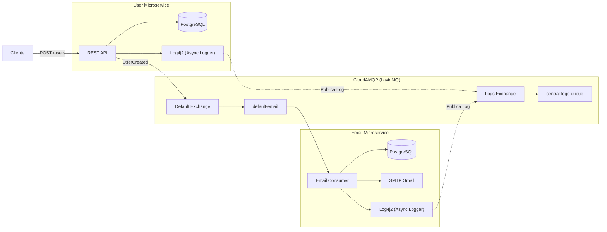

# Microservices na prática com Java Spring

## Descrição

### Vídeo 01 — Comunicação assíncrona entre microsserviços

Este projeto demonstra a construção de uma arquitetura de microsserviços utilizando **Java 21** e **Spring Boot 4**. O objetivo é desenvolver dois serviços independentes (**User** e **Email**) que se comunicam de forma assíncrona por meio do **CloudAMQP (LavinMQ)**, responsável por intermediar as mensagens entre os serviços.

Sempre que um novo usuário é cadastrado, o microsserviço **User** publica uma mensagem em uma *Exchange*. O microsserviço **Email** consome essa mensagem a partir de uma fila e realiza o envio do e-mail de boas-vindas, mantendo os serviços desacoplados e independentes.

### Vídeo 02 — Centralização de Logs

Nesta etapa foram implementadas melhorias relacionadas à observabilidade da aplicação.

Enquanto o vídeo original apresenta uma solução síncrona aplicada a apenas um microsserviço, adaptei a implementação para funcionar em um ambiente com múltiplos microsserviços utilizando o **CloudAMQP (LavinMQ)**.

Cada microsserviço utiliza o **Log4j2** para gerar logs estruturados em formato JSON direcionados ao console. Para integrar o Log4j2 ao LavinMQ sem impactar o processo de inicialização da aplicação, desenvolvi um componente baseado no ciclo de vida do Spring (`CommandLineRunner`).

Após a inicialização da aplicação, esse componente captura os eventos gerados pelo Log4j2 e os publica de forma assíncrona, utilizando o **RabbitTemplate**, em uma **Exchange** exclusiva para logs. Todos os registros são encaminhados para uma fila central (`central-logs-queue`), permitindo concentrar os logs dos microsserviços **User** e **Email** em um único ponto de observabilidade.

### Vídeo 03

*(Em desenvolvimento.)*

---

## Implementação

A arquitetura utiliza dois fluxos assíncronos independentes:

- **Fluxo de negócio:** responsável pela comunicação entre os microsserviços **User** e **Email** para o envio de e-mails.
- **Fluxo de observabilidade:** responsável por centralizar os logs gerados por todos os microsserviços em uma fila exclusiva de logs.



### Principais tecnologias

- **Linguagem:** Java 21
- **Framework:** Spring Boot 4.x
- **Mensageria:** RabbitMQ / LavinMQ (CloudAMQP)
- **Banco de Dados:** PostgreSQL (um banco para cada microsserviço)
- **Integração:** Spring AMQP e Spring Mail (SMTP Gmail)
- **Logs e Observabilidade:** Log4j2 (Async Logger), LMAX Disruptor e JSON Template Layout

---

## Como Executar

O projeto possui scripts automatizados para subir a infraestrutura necessária e executar os microsserviços.

1. Configure as credenciais do **CloudAMQP** e do banco de dados nos arquivos `.env` de cada microsserviço.
2. Execute o microsserviço **User**:

```bash
./scripts/run-user.sh
```

3. Execute o microsserviço **Email**:

```bash
./scripts/run-email.sh
```

---

## O que implementei além dos vídeos?

### Vídeo 01

Além do conteúdo apresentado no vídeo, realizei algumas melhorias para tornar o projeto mais organizado e próximo de um ambiente real de desenvolvimento:

- implementei o **Flyway** para versionamento e controle das migrações do banco de dados;
- utilizei um arquivo **`.env`** para armazenar variáveis sensíveis e facilitar a configuração da aplicação;
- criei scripts **`.sh`** para simplificar a inicialização dos microsserviços **User** e **Email**;
- separei os **DTOs** de requisição e resposta, evitando o uso direto das entidades na API;
- implementei **Mappers** para realizar a conversão entre entidades e DTOs.

### Vídeo 02

Também adaptei a implementação apresentada no curso para um cenário com múltiplos microsserviços:

- implementei o sistema de logs em ambos os microsserviços (**User** e **Email**);
- adaptei o envio dos logs para funcionar de forma **assíncrona**;
- criei uma **Exchange** exclusiva para o fluxo de logs, separando a observabilidade do fluxo de negócio;
- centralizei todos os logs em uma única fila no **CloudAMQP**, permitindo que diferentes microsserviços compartilhem a mesma infraestrutura de logging;
- desenvolvi um componente responsável por integrar o **Log4j2** ao **LavinMQ**, permitindo que qualquer microsserviço publique seus logs utilizando a mesma infraestrutura.

> **Nota Arquitetural**
>
> A solução implementada realiza alocações temporárias de strings durante a captura dos eventos de log. Embora essa abordagem atenda adequadamente aplicações de pequeno e médio porte, uma evolução futura consiste em utilizar agentes externos de coleta de logs, como **Fluent Bit** ou **Logstash**, responsáveis por capturar diretamente a saída padrão (`SYSTEM_OUT`) da aplicação, reduzindo a pressão sobre o Garbage Collector (GC) e desacoplando completamente a infraestrutura de observabilidade da aplicação.

### Vídeo 03

*(Em desenvolvimento.)*

---

## Aprendizados

### Vídeo 01

- Comunicação assíncrona entre microsserviços.
- Producer e Consumer utilizando Spring AMQP.
- Exchanges, Queues e Bindings no RabbitMQ.
- Envio de e-mails utilizando Spring Mail.
- Desacoplamento entre serviços através de mensageria.

### Vídeo 02

- Configuração do Log4j2 com Async Logger.
- Utilização do LMAX Disruptor para processamento assíncrono de logs.
- Publicação de logs utilizando RabbitTemplate.
- Centralização de logs entre múltiplos microsserviços.
- Separação entre o fluxo de negócio e o fluxo de observabilidade.

---

## Referências

1. **Michelli Brito** — [Microservices na prática com Java Spring](https://www.youtube.com/watch?v=ZnECi2gatMs)

2. **Michelli Brito** — [Spring Logging no Microservice de Email](https://www.youtube.com/watch?v=tCErZHxaTxg&list=PL8iIphQOyG-Dp037UnFG0x8aduelvZZWE&index=6&t=872s)