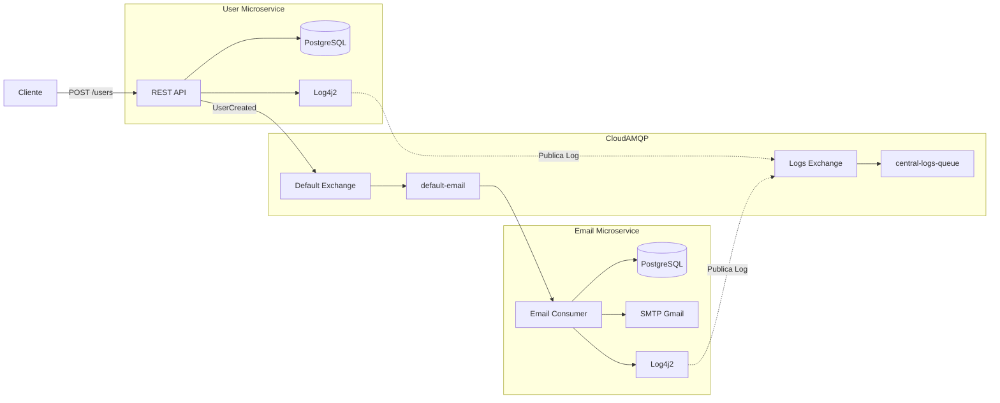

# Microservices na prática com Java Spring

## Descrição

### Vídeo 01 — Comunicação assíncrona entre microsserviços

Este projeto demonstra a construção de uma arquitetura de microsserviços utilizando **Java 21** e **Spring Boot 3**. O objetivo é desenvolver dois serviços independentes (**User** e **Email**) que se comunicam de forma assíncrona por meio do **RabbitMQ**, responsável por intermediar as mensagens entre os serviços.

Sempre que um novo usuário é cadastrado, o microsserviço **User** publica uma mensagem em uma *Exchange*. O microsserviço **Email** consome essa mensagem a partir de uma fila e realiza o envio do e-mail de boas-vindas, mantendo os serviços desacoplados e independentes.

### Vídeo 02 — Centralização de logs

Nesta etapa foram implementadas melhorias relacionadas à observabilidade da aplicação.

Enquanto o vídeo apresenta uma solução síncrona aplicada a apenas um microsserviço, adaptei a implementação para um ambiente com múltiplos microsserviços utilizando **CloudAMQP**.

Cada microsserviço possui seu próprio **Log4j2**, responsável por capturar os eventos da aplicação. Por meio de uma ponte programática desenvolvida no projeto, esses logs são publicados de forma assíncrona em uma **Exchange exclusiva de logs**. Todos os registros são encaminhados para uma fila central, permitindo centralizar os logs dos microsserviços **User** e **Email** em um único local, sem impactar o fluxo principal da aplicação.

### Vídeo 03

*(Em desenvolvimento.)*

---

## Implementação

A arquitetura utiliza dois fluxos assíncronos independentes:

- **Fluxo de negócio:** responsável pela comunicação entre os microsserviços **User** e **Email** para o envio de e-mails.
- **Fluxo de observabilidade:** responsável por centralizar os logs gerados por todos os microsserviços em uma fila exclusiva de logs.

### Principais tecnologias

- **Linguagem:** Java 21
- **Framework:** Spring Boot 3
- **Mensageria:** RabbitMQ (CloudAMQP)
- **Banco de Dados:** PostgreSQL (uma base para cada microsserviço)
- **Integração:** Spring AMQP e Spring Mail (SMTP Gmail)
- **Logs:** Log4j2 + LavinMQ + CloudAMQP

---

## Sugestões de Evolução

### Vídeo 01

Durante o curso, a autora apresenta algumas possibilidades para evoluir a aplicação:

- **Expandir o modelo de usuário**
  - Adicionar novos atributos ao modelo, como endereço completo, username, senha e categoria/perfil do usuário, tornando a entidade mais próxima de um cenário real de produção.

- **Implementar um CRUD completo**
  - O projeto implementa apenas a operação de cadastro (`POST`), pois o foco é demonstrar a comunicação assíncrona entre microsserviços.
  - Como evolução, recomenda-se implementar os endpoints `GET`, `PUT` e `DELETE`, completando o ciclo de vida da entidade.

- **Adicionar validações de negócio**
  - Validar se o e-mail já está cadastrado antes da persistência.
  - Implementar regras de integridade dos dados.
  - Melhorar o tratamento de exceções e das respostas retornadas pela API.

- **Utilizar interfaces na camada de Service**
  - Definir interfaces para os serviços em vez de depender diretamente das implementações concretas.
  - Essa abordagem reduz o acoplamento entre as camadas e facilita futuras alterações, além de seguir boas práticas utilizadas em arquiteturas como a Arquitetura Hexagonal.

- **Explorar outros padrões de comunicação**
  - Além da comunicação por comandos (*Command*), a autora recomenda estudar outros padrões utilizados em arquiteturas distribuídas, como:
    - Event Notification;
    - Event State Transfer;
    - Sagas utilizando Orquestração;
    - Sagas utilizando Coreografia.

### Vídeo 02

Durante o vídeo, a autora demonstra a configuração do sistema de logs utilizando o **Log4j2** integrado ao **RabbitMQ/LavinMQ**.

Como possíveis evoluções do projeto, podem ser implementadas:

- Centralizar os logs de múltiplos microsserviços em uma única Exchange e fila, permitindo que toda a aplicação compartilhe a mesma infraestrutura de observabilidade.
- Adaptar o envio de logs para funcionar de forma totalmente assíncrona, evitando impacto na execução da aplicação.
- Criar componentes reutilizáveis para que novos microsserviços possam integrar-se ao sistema de logs com pouca configuração.
- Evoluir a arquitetura para incluir uma plataforma de análise de logs, como ELK Stack, Grafana Loki ou Graylog.

### Vídeo 03

*(Em desenvolvimento.)*

---

## Referências

1. **Michelli Brito** — [Microservices na prática com Java Spring](https://www.youtube.com/watch?v=ZnECi2gatMs)

2. **Michelli Brito** — [Spring Logging no Microservice de Email](https://www.youtube.com/watch?v=tCErZHxaTxg&list=PL8iIphQOyG-Dp037UnFG0x8aduelvZZWE&index=6&t=872s)