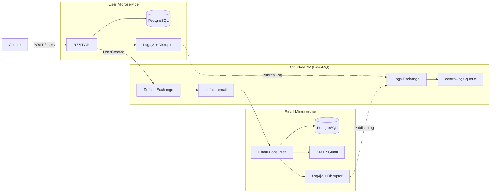

# Microservices na prática com Java Spring

## Descrição

### Vídeo 01 — Comunicação assíncrona entre microsserviços

Este projeto demonstra a construção de uma arquitetura de microsserviços utilizando **Java 21** e **Spring Boot 4**. O objetivo é desenvolver dois serviços independentes (**User** e **Email**) que se comunicam de forma assíncrona por meio do **Cloud AMQP (LavinMQ)**, responsável por intermediar as mensagens entre os serviços.

Sempre que um novo usuário é cadastrado, o microsserviço **User** publica uma mensagem em uma *Exchange*. O microsserviço **Email** consome essa mensagem a partir de uma fila e realiza o envio do e-mail de boas-vindas, mantendo os serviços desacoplados e independentes.

### Vídeo 02 — Centralização de logs de Alta Performance

Nesta etapa foram implementadas melhorias relacionadas à observabilidade da aplicação.

Enquanto o vídeo original apresenta uma solução síncrona aplicada a apenas um microsserviço, adaptei e evoluí a implementação para um ecossistema nativo em nuvem com múltiplos microsserviços utilizando o **CloudAMQP (LavinMQ)**.

Cada microsserviço utiliza o Log4j2 para gerar logs estruturados em formato JSON direcionados ao console. Para realizar a integração com o LavinMQ sem travar a inicialização do ecossistema, desenvolvi uma ponte programática baseada no ciclo de vida do Spring (`CommandLineRunner`). Esse componente captura as saídas de log de forma assíncrona após o boot da aplicação e utiliza o `RabbitTemplate` para publicá-las em uma *Exchange* exclusiva de logs. Todos os registros são encaminhados para uma fila central (`central-logs-queue`), permitindo auditoria unificada de todo o ecossistema.

### Vídeo 03

*(Em desenvolvimento.)*

---

## Implementação

A arquitetura utiliza dois fluxos assíncronos independentes:

- **Fluxo de negócio:** responsável pela comunicação entre os microsserviços **User** e **Email** para o envio de e-mails.
- **Fluxo de observabilidade:** responsável por centralizar os logs gerados por todos os microsserviços em uma fila exclusiva de logs.



### Principais tecnologias

- **Linguagem:** Java 21
- **Framework:** Spring Boot 4.x
- **Mensageria:** RabbitMQ / LavinMQ (CloudAMQP)
- **Banco de Dados:** PostgreSQL (Bancos isolados via Docker)
- **Integração:** Spring AMQP e Spring Mail (SMTP Gmail)
- **Logs e Observabilidade:** Log4j2 Assíncrono + LMAX Disruptor + JSON Template Layout

---

## Como Executar

O projeto possui scripts automatizados para subir a infraestrutura do Docker (PostgreSQL) e a aplicação Spring Boot em paralelo.

1. Configure as credenciais do CloudAMQP e do banco nos arquivos `.env` na raiz de cada microsserviço.
2. Para rodar o microsserviço de Usuário:
   ```bash
   ./scripts/run-user.sh
   ```
3. Para rodar o microsserviço de E-mail:
   ```bash
   ./scripts/run-email.sh
   ```

---

## Referências

1. **Michelli Brito** — [Microservices na prática com Java Spring](https://www.youtube.com/watch?v=ZnECi2gatMs)

2. **Michelli Brito** — [Spring Logging no Microservice de Email](https://www.youtube.com/watch?v=tCErZHxaTxg&list=PL8iIphQOyG-Dp037UnFG0x8aduelvZZWE&index=6&t=872s)
