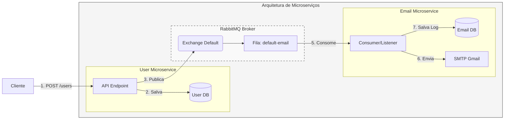

# Microservices na prática com Java Spring

## Descrição

(Vídeo 01)
Este projeto demonstra a construção de uma arquitetura de microsserviços baseada em Java e *Spring Boot*. O objetivo principal é implementar dois serviços independentes (**User** e **Email**) que se comunicam de forma assíncrona utilizando o *RabbitMQ* como *broker* de mensageria para processar o envio de e-mails de boas-vindas após o cadastro de usuários.

(Vídeo 02)

(Vídeo 03)

## Implementação
O fluxo segue um modelo de comunicação por comandos, onde o serviço de usuários atua como *producer* e o serviço de e-mails como *consumer*.

**Principais tecnologias utilizadas:**
* **Linguagem:** Java 21
* **Framework:** Spring Boot 3
* **Mensageria:** RabbitMQ (via CloudAMQP)
* **Banco de Dados:** PostgreSQL (uma base por microserviço)
* **Integração:** Spring AMQP, Spring Mail (SMTP Gmail)

## Sugestão de Evolução
(Vídeo 01)
Durante o vídeo, a autora apresenta diversas sugestões de melhorias e boas práticas para a evolução dos microservices implementados. Abaixo, listo as principais recomendações mencionadas:
1. **Expansão do Modelo de Usuário:**
   * **Descrição:** A autora sugere que o *User Model* seja enriquecido com atributos adicionais para tornar o sistema mais completo, como endereço completo, *username*, senha e categoria de usuário.

2. **Implementação de um CRUD Completo:**
   * **Descrição:** Como o objetivo principal do vídeo foi demonstrar a comunicação assíncrona, foi implementado apenas o método *POST*. Ela recomenda a criação de métodos *GET* (para listagem e busca), *PUT* (para atualização) e *DELETE* (para exclusão) para compor um ciclo de vida real da aplicação.

3. **Validações de Negócio Adicionais:**
   * **Descrição:** É sugerida a implementação de verificações de integridade, como checar se o e-mail já existe na base de dados antes de persistir um novo usuário, evitando duplicações.

4. **Uso de Interfaces nos Services:**
   * **Descrição:** Como boa prática de arquitetura (alinhada à arquitetura hexagonal), ela recomenda utilizar **interfaces** nos *Services* em vez de depender diretamente das classes concretas. Isso garante um maior desacoplamento entre as camadas do sistema.

5. **Exploração de Padrões de Comunicação:**
   * **Descrição:** A autora reforça que a mensageria via comandos é apenas um caminho. Ela sugere o estudo de outros padrões essenciais para arquiteturas distribuídas, como:
      * Comunicação via **Eventos** (*Event Notification* e *Event State Transfer*).
      * Implementação de **Sagas** (utilizando orquestração ou coreografia) para gerenciar fluxos de trabalho complexos e garantir a consistência dos dados.

(Vídeo 02)

(Vídeo 03)

## Referência
01. Vídeo original: [Microservices na prática com Java Spring](https://www.youtube.com/watch?v=wlYvA2b1BWI) por *Michelli Brito*.

## O que eu fiz de diferente?

(Vídeo 01)
- Implementei o Flyway
- Criei .env para guardar variáveis sensiveis
- Criei arquivos .sh para facilitar rodar os ms user e ms email
- Criei DTOS de criação e de resposta e fiz um mapper

(Vídeo 02)
- Add nos dois microsserviços
- deixei de forma assicrono e enviei os logs para cloud amqp

(Vídeo 03)