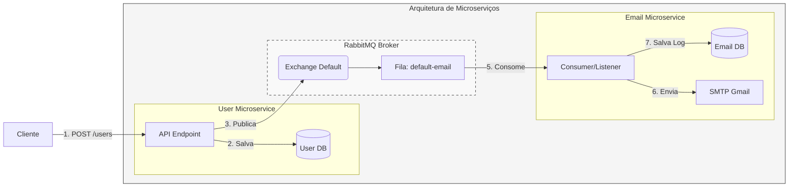

# Microservices na prática com Java Spring

## Descrição
Este projeto demonstra a construção de uma arquitetura de microsserviços baseada em Java e *Spring Boot*. O objetivo principal é implementar dois serviços independentes (**User** e **Email**) que se comunicam de forma assíncrona utilizando o *RabbitMQ* como *broker* de mensageria para processar o envio de e-mails de boas-vindas após o cadastro de usuários.

## Implementação
O fluxo segue um modelo de comunicação por comandos, onde o serviço de usuários atua como *producer* e o serviço de e-mails como *consumer*.

**Principais tecnologias utilizadas:**
* **Linguagem:** Java 21
* **Framework:** Spring Boot 3
* **Mensageria:** RabbitMQ (via CloudAMQP)
* **Banco de Dados:** PostgreSQL (uma base por microserviço)
* **Integração:** Spring AMQP, Spring Mail (SMTP Gmail)

## Referência
Vídeo original: [Microservices na prática com Java Spring](https://www.youtube.com/watch?v=wlYvA2b1BWI) por *Michelli Brito*.

## O que eu fiz de diferente?

- Implementei o Flyway
- Criei .env para guardar variáveis sensiveis
- Criei arquivos .sh para facilitar rodar os ms user e ms email
- Criei DTOS de criação e de resposta e fiz um mapper