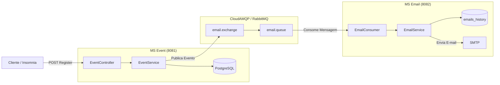

# Construindo Microsserviços com Java & Spring Boot

Este projeto é uma evolução prática baseada na live da desenvolvedora Fernanda Kipper, com foco na construção de uma arquitetura de microsserviços para **inscrição em eventos** e **envio automatizado de e-mails**.

Além da implementação apresentada na live, foram realizadas melhorias para tornar a aplicação mais próxima de um ambiente de produção, aumentando o desacoplamento entre os serviços, a persistência dos dados e a organização da aplicação.

## O que foi implementado de diferente?

Foram aplicadas as seguintes melhorias em relação ao projeto original:

- **Mensageria Assíncrona (CloudAMQP / RabbitMQ):** A comunicação síncrona via HTTP (*Feign Client*) foi substituída por uma arquitetura orientada a eventos. O microsserviço de eventos publica mensagens no **CloudAMQP**, enquanto o microsserviço de e-mail as consome de forma assíncrona, tornando a comunicação mais desacoplada e resiliente.

- **Persistência com PostgreSQL:** Substituição do banco de dados em memória (H2) pelo **PostgreSQL**, proporcionando persistência dos dados em um banco relacional.

- **Versionamento de Banco com Flyway:** Integração do **Flyway Migrations** no microsserviço de e-mail para gerenciar a criação e evolução da tabela `emails_history`.

- **Tratamento Global de Exceções:** Organização da camada de exceções em uma estrutura dedicada, separando responsabilidades entre exceções de negócio, objetos de resposta e tratamento global.

```text
exceptions/
├── domain/      # Exceções de negócio
├── dtos/        # Objetos de resposta de erro
└── handlers/    # Tratamento global (@ControllerAdvice)
```

---

## Arquitetura e Funcionamento do Sistema

O diagrama abaixo representa o fluxo de inscrição em um evento e o envio assíncrono do e-mail de confirmação.



### Fluxo da aplicação

1. O cliente realiza a inscrição em um evento.
2. O microsserviço **MS Event** valida a inscrição e atualiza os dados no PostgreSQL.
3. Após concluir a operação, uma mensagem é publicada no RabbitMQ.
4. O **MS Email** consome essa mensagem de forma assíncrona.
5. O histórico do envio é persistido na tabela `emails_history`.
6. O e-mail de confirmação é enviado ao participante.

---

## Tecnologias Utilizadas

- **Java 21**
- **Spring Boot 4.x**
  - Spring Web
  - Spring Data JPA
  - Spring AMQP
- **PostgreSQL**
- **Flyway**
- **CloudAMQP (RabbitMQ)**
- **Lombok**

---

## Referência Original

- **Vídeo:** [CONSTRUINDO MICROSERVIÇOS COM JAVA](https://www.youtube.com/watch?v=yACzWg9gUGM&t=5840s) — Fernanda Kipper.
